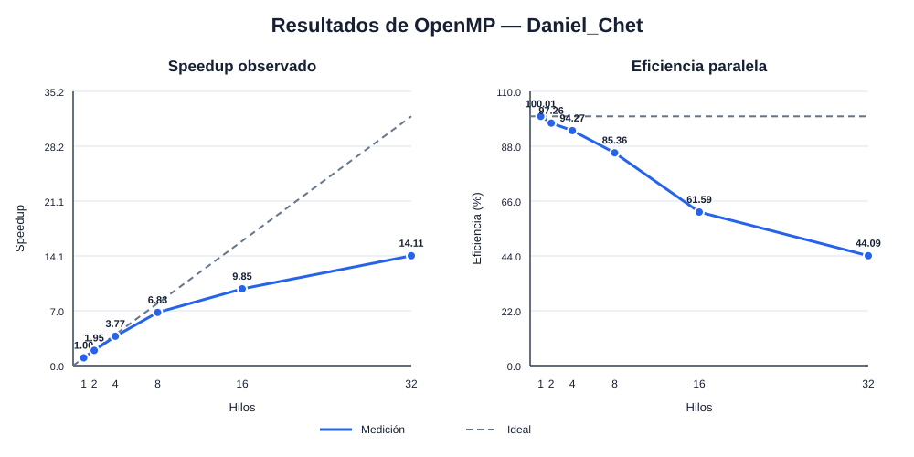
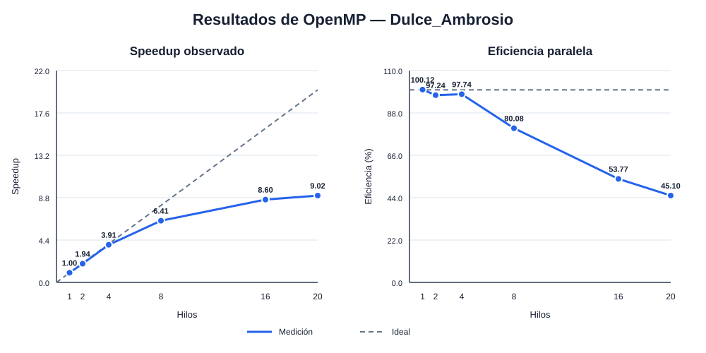

# Integralmente Paralelos — Integración numérica con OpenMP

Proyecto final del **Grupo 6** para el Parcial 1 de CC3069 — Computación
Paralela y Distribuida. La consultora HPC **Integralmente Paralelos** implementó
el **Problema 2: integración numérica mediante una suma de Riemann**, comparando
una solución secuencial con una versión paralela optimizada mediante OpenMP.

## Integrantes

- **Daniel Chet - 231177**
- **Dulce Ambrosio - 231143**

El desarrollo, la metodología, las evidencias y el análisis completo se
encuentran en el [informe final del parcial](<docs/Parcial 1 - Paralela.pdf>).

## Contexto y datos

Se aproxima el área de una función positiva y computacionalmente exigente en el
intervalo `[0, 10]` usando por defecto `10^9` rectángulos y la regla del punto
medio:

```text
f(x) = exp(-x/10) · (sin²(x) + cos²(2x) + sqrt(x+1) + ln(x+1))
       + 1/(1+x²)

h   = (b-a)/n
xᵢ  = a + (i+0.5)h
área ≈ h · Σ f(xᵢ),  i = 0, ..., n-1
```

La función combina operaciones trigonométricas, exponenciales, logarítmicas y
algebraicas, por lo que cada iteración contiene suficiente trabajo para
amortizar el costo de OpenMP. Los puntos se calculan bajo demanda: no se almacena
un arreglo de mil millones de elementos. Se emplean índices de 64 bits y valores
`double`, con memoria adicional `O(1)` en la versión secuencial.

## Estrategia de paralelización

La solución secuencial recorre todos los rectángulos y acumula sus alturas en
una sola suma. La versión paralela conserva el mismo cálculo y utiliza:

- `#pragma omp parallel` para crear el equipo de trabajadores una sola vez.
- `#pragma omp for schedule(static)` para distribuir iteraciones de costo
  uniforme con poco *overhead* y buen balance de carga.
- `reduction(+:suma)` para proporcionar una suma privada a cada hilo y combinar
  los resultados al final sin condiciones de carrera.
- `default(none)` para exigir una clasificación explícita de las variables.
- `omp_set_dynamic(0)` para respetar la cantidad de hilos solicitada durante los
  experimentos y `omp_get_wtime()` para medir tiempo de pared.

No se usa `critical` ni `atomic` dentro del ciclo, pues serializar mil millones
de actualizaciones eliminaría el beneficio del paralelismo. La complejidad es
`O(n)` secuencial y aproximadamente `O(n/p)` para `p` hilos, más el costo de
crear el equipo y combinar las sumas parciales.

## Estructura del repositorio

```text
.
├── include/       Código común y función a integrar
├── secuencial/    Implementación base
├── paralelo/      Implementación con OpenMP
├── scripts/       Compilación, pruebas y mediciones
└── docs/          Informe final, CSV, gráficas y evidencias
```

## Requisitos

- Windows PowerShell 5.1 o PowerShell 7
- GCC/G++ con soporte para C++20 y OpenMP

En MSYS2, el compilador adecuado es el paquete UCRT64 de GCC. Puede comprobarse
el soporte instalado con:

```powershell
g++ --version
```

## Compilación

Desde la raíz del repositorio:

```powershell
.\scripts\build.ps1
```

Si Windows bloquea la ejecución de scripts por su política local, puede usarse
sin modificarla permanentemente:

```powershell
powershell.exe -NoProfile -ExecutionPolicy Bypass -File .\scripts\build.ps1
```

Los ejecutables se generan en `build/secuencial.exe` y
`build/paralelo.exe`. La compilación utiliza optimización `-O3` en ambos casos;
la única diferencia relevante es `-fopenmp` para la versión paralela.

## Ejecución

La cantidad solicitada por el problema es de mil millones de rectángulos:

```powershell
.\build\secuencial.exe --rectangles 1000000000
.\build\paralelo.exe --rectangles 1000000000 --threads 8
```

Para una prueba corta:

```powershell
.\build\secuencial.exe --rectangles 1000000
.\build\paralelo.exe --rectangles 1000000 --threads 4
```

Todos los parámetros disponibles pueden consultarse con `--help`. El intervalo
también es configurable mediante `--a` y `--b` (se exige `a >= 0` por el dominio
de la función elegida).

## Verificación y benchmark

La prueba automatizada compara la respuesta secuencial con ejecuciones paralelas
de 1, 2 y 4 hilos:

```powershell
.\scripts\test.ps1
```

La prueba valida el área contra un valor numérico de referencia y comprueba que
las ejecuciones paralelas de 1, 2 y 4 hilos mantengan un error relativo menor que
`10⁻¹¹`. El área obtenida con `10⁹` rectángulos fue aproximadamente
`30.80821253644`.

## Metodología experimental

Cada integrante ejecutó su campaña en su propia computadora con estas
condiciones:

- `10⁹` rectángulos por corrida.
- Cinco repeticiones secuenciales y cinco por cada cantidad de hilos.
- Una ejecución corta de calentamiento que no se incluyó en las métricas.
- Los mismos binarios compilados con `-O3 -march=native`; la versión paralela
  agrega `-fopenmp`.
- La mediana como medida de tiempo para reducir el efecto de interrupciones
  ocasionales del sistema operativo.

Las métricas se calcularon de forma independiente en cada computadora:

```text
speedup(p)    = T_secuencial / T_paralelo(p)
eficiencia(p) = speedup(p) / p · 100 %
```

## Resultados individuales

### Daniel Chet

Equipo de prueba: **Intel Core i9-13980HX, 24 núcleos y 32 hilos lógicos**.

Tiempo secuencial mediano: **37.29 s**.

| Hilos | Tiempo paralelo (s) | Speedup | Eficiencia | Error relativo máx. |
|------:|---------------------:|--------:|-----------:|--------------------:|
| 1  | 37.28 | 1.00  | 100.01 % | 0 |
| 2  | 19.17 | 1.95  | 97.26 %  | 5.24 × 10⁻¹³ |
| 4  | 9.89  | 3.77  | 94.27 %  | 1.98 × 10⁻¹² |
| 8  | 5.46  | 6.83  | 85.36 %  | 1.99 × 10⁻¹² |
| 16 | 3.78  | 9.85  | 61.59 %  | 2.00 × 10⁻¹² |
| 32 | 2.64  | 14.11 | 44.09 %  | 1.99 × 10⁻¹² |

- [Corridas completas](docs/resultados/Daniel_Chet_corridas.csv)
- [Resumen calculado](docs/resultados/Daniel_Chet_resumen.csv)
- [Evidencia del inicio de la campaña](docs/evidencias/Captura%20de%20pantalla%202026-09-11%20181103.png)
- [Evidencia del resumen final](docs/evidencias/Captura%20de%20pantalla%202026-09-11%20181202.png)



### Dulce Ambrosio

Equipo de prueba: **Intel Core i7 de 12.ª generación, 14 núcleos, 20 hilos
lógicos y 8 GB de RAM**.

Tiempo secuencial mediano: **24.51 s**.

| Hilos | Tiempo paralelo (s) | Speedup | Eficiencia | Error relativo máx. |
|------:|---------------------:|--------:|-----------:|--------------------:|
| 1  | 24.48 | 1.00 | 100.12 % | 0 |
| 2  | 12.60 | 1.94 | 97.24 %  | 5.24 × 10⁻¹³ |
| 4  | 6.27  | 3.91 | 97.74 %  | 1.98 × 10⁻¹² |
| 8  | 3.83  | 6.41 | 80.08 %  | 1.99 × 10⁻¹² |
| 16 | 2.85  | 8.60 | 53.77 %  | 2.00 × 10⁻¹² |
| 20 | 2.72  | 9.02 | 45.10 %  | 1.98 × 10⁻¹² |

- [Corridas completas](docs/resultados/Dulce_Ambrosio_corridas.csv)
- [Resumen calculado](docs/resultados/Dulce_Ambrosio_resumen.csv)
- [Evidencia de ejecución y resultados](docs/evidencias/Dulce.png)



## Análisis y conclusiones

- La reducción de OpenMP produjo resultados numéricamente equivalentes a los de
  la versión secuencial. El mayor error relativo observado fue cercano a
  `2 × 10⁻¹²`, diferencia esperada porque la suma en punto flotante no es
  asociativa y cambia su orden entre hilos.
- Con 2 y 4 hilos se obtuvo escalamiento casi lineal. La eficiencia a 4 hilos fue
  **94.27 %** para Daniel y **97.74 %** para Dulce, lo que confirma que
  `schedule(static)` se adapta bien a la carga uniforme.
- El menor tiempo de Daniel fue **2.64 s con 32 hilos**, un *speedup* de
  **14.11×**. El menor tiempo de Dulce fue **2.72 s con 20 hilos**, un *speedup*
  de **9.02×**.
- Aunque el tiempo siguió disminuyendo al agregar hilos, la eficiencia bajó por
  los costos de coordinación, la reducción final y la competencia por recursos
  compartidos del procesador. Por ello, más hilos mejoran el rendimiento total,
  pero no de manera proporcional indefinidamente.

En conjunto, las mediciones muestran que la suma de Riemann es altamente
paralelizable cuando el número de rectángulos es grande y que una reducción, en
lugar de sincronizar cada actualización, permite obtener una mejora sustancial
sin sacrificar la precisión del resultado.
